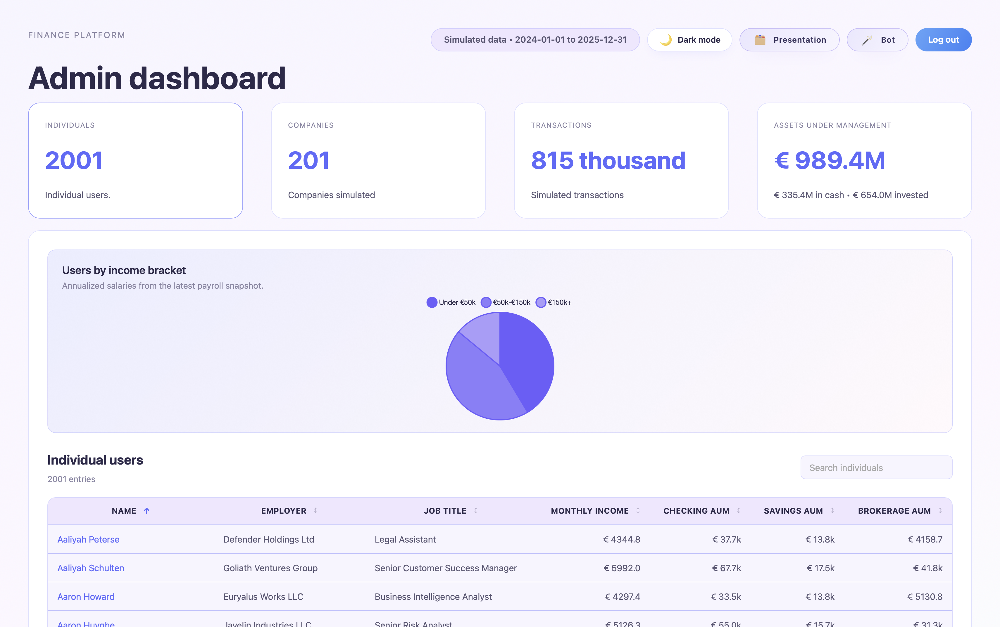
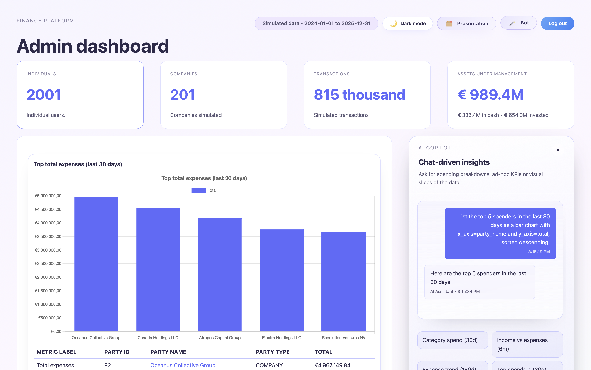
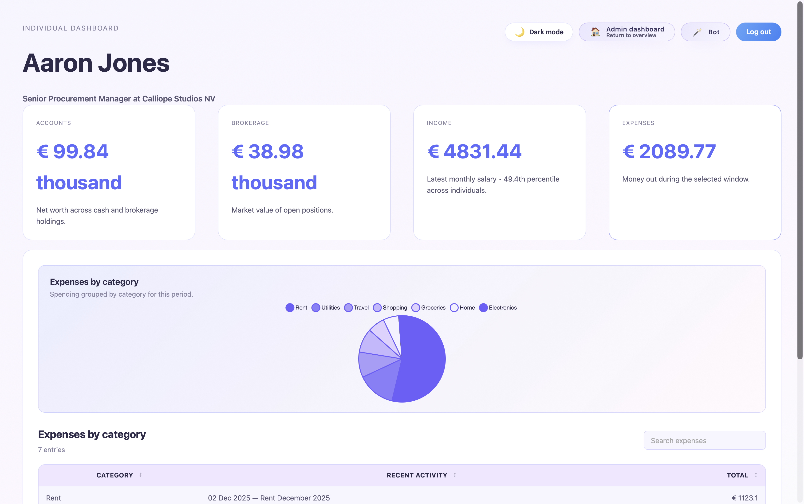
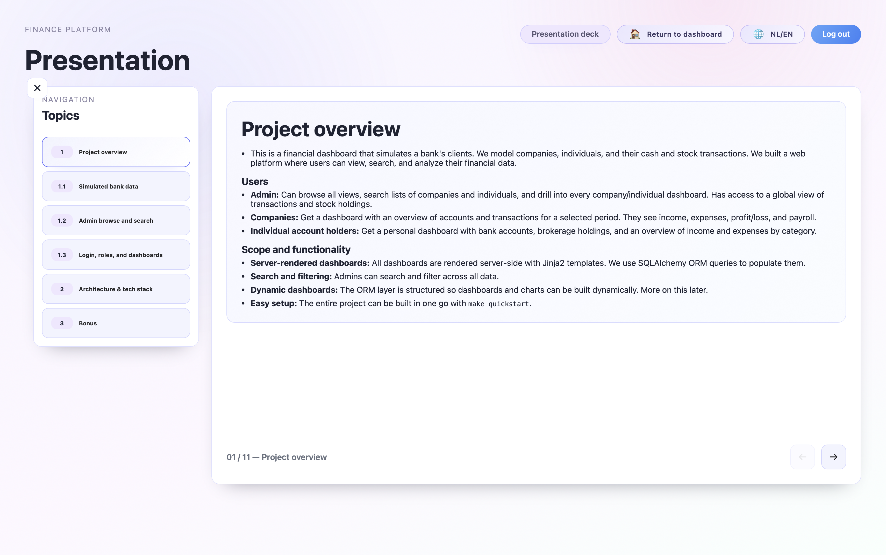

# Finance Platform

A full-stack financial dashboard that simulates bank clients, transactions, and
market holdings. It combines realistic synthetic data generation with a MariaDB
back end, a FastAPI service layer, and server-rendered dashboards powered by
HTMX and Chart.js.

The project includes LLM chatbot integration using OpenAI/Anthropic APIs to answer finance
questions, generate chart-ready JSON, and build dashboard insights from the same
service layer and database schema.

The project includes an interactive presentation/walkthrough that can be accessed when
logged in and viewing the admin dashboard.

## Highlights
- End-to-end pipeline: synthetic data generation -> MariaDB -> FastAPI -> HTMX dashboards.
- Separate user and admin experiences, with role-aware routing and permissions.
- Real market data integration (Yahoo Finance) for price history and FX rates.
- Visual insights: charts, category breakdowns, and portfolio performance.
- Performance tuned for large datasets on modest hardware.

## Features
- Data generation with reproducible, scale-friendly presets (small/medium/large).
- Individual dashboards: net worth, cash flow, accounts, holdings, income, expenses.
- Company dashboards: net worth, payroll, income/expense analysis, cash flow.
- Admin dashboard: browse/search all users, companies, holdings, and transactions.
- Stock insights: aggregated holdings, gains/losses, and performance trends.
- AI chatbot: data-aware chart and table generation.

## Tech Stack
- Backend: Python 3.11+, FastAPI, SQLAlchemy, Pydantic
- Database: MariaDB (Docker Compose)
- Frontend: Jinja2, HTMX, Chart.js, vanilla CSS
- Data + tooling: Faker, yfinance, pytest, rich

## Architecture Overview
- **Data pipeline**: `scripts/fetch_stock_prices.py` pulls real market data, while
  `scripts/gen_seed_data.py` builds a double-entry ledger and holdings model.
- **Service layer**: domain logic lives in `app/services/` to keep routing thin.
- **Dashboards**: server-rendered templates plus HTMX for fast, targeted updates.

## Quickstart
```bash
make quickstart
```
or
```bash
make quickstart-large
make quickstart-small
```

More options are in `QUICKSTART_OPTIONS.md`.

## Demo Accounts
Credentials are configurable in `.env` (see `.env.example`).

- Admin: `admin` / `adminpass`
- Demo user password: `demo` (username varies, e.g. `u1`)

## Screenshots






## Performance Benchmarks
- Hardware: MacBook Air M4
- Python: 3.14.0
- MariaDB: 11.8.3

Large preset results (cached market data):
- Dataset: 2000 individuals, 200 companies, 24 months
- Seed data size: 188.0 MB
- Journal entries: 814,809 rows
- Journal lines: 1,629,618 rows
- Trades: 16,755 rows
- Price quotes: 7,542 rows
- Generate seed data: 10.14s
- Load CSVs into MariaDB: 38.35s
- Pipeline total (generate + load): 48.49s
- Full rerun total (includes DB clear): 76.31s

## Project Structure
```
app/
  core/          # config, logging, security
  models/        # SQLAlchemy models
  services/      # business logic
  routers/       # FastAPI routes
  templates/     # Jinja2 templates
  static/        # CSS/JS assets
scripts/         # data generation and loading
sql/             # schema
```
