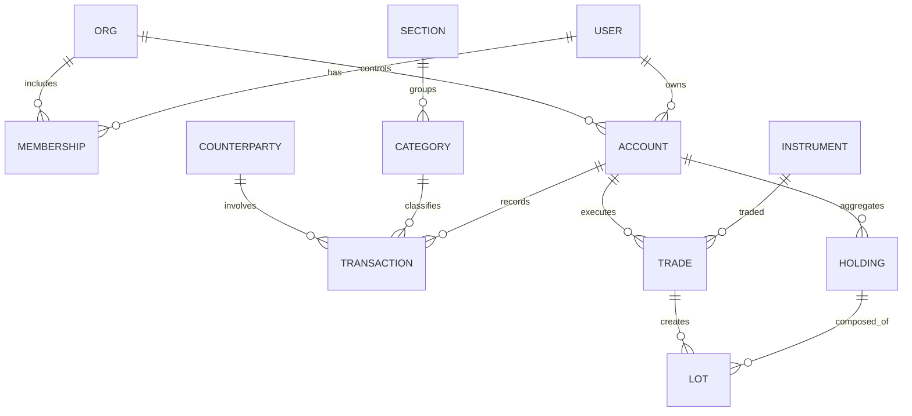

# Finance Dashboard — Simulated Wealth Manager

A compact Python + MariaDB project that ingests CSV data, simulates multi‑user banking and brokerage activity, and exposes analytics/dashboards for individuals, companies, and a bank admin view. 

---

## Purpose
- Model real‑world money flows (checking/savings) and basic brokerage (equities) for **multiple user types**: bank admin, corporate, individual.
- Support **internal transfers** (user↔user inside the system) and **external** (to/from outside counterparties).
- Track **positions**, **average acquisition cost**, **realized/unrealized P&L**, and show useful summaries.

---

## Tech Stack
- **Python** (3.14) — ETL, business logic, tests
- **MariaDB** (via Docker) — persistence
- **SQLAlchemy** — ORM / DB access
- **Pandas** — CSV ingest & transforms
- Optional clients: **DBeaver** (DB GUI)

> Logging: `logger.py` writes colored console logs and date‑rotated files in `logs/` (e.g., `2025-10-13_app.log`).

---

## Repository Layout (intended)
```
finance/
├─ app/
│  ├─ db/               # SQLAlchemy models, session mgmt
│  ├─ services/         # domain logic (transactions, trades, holdings)
│  ├─ etl/              # CSV ingestion helpers
│  ├─ utils/logger.py   # lightweight logger (console + file)
│  └─ __init__.py
├─ scripts/
│  ├─ db_smoketest.py   # quick connectivity check
│  ├─ ingest_transactions.py
│  └─ ingest_trades.py
├─ sql/
│  └─ schema.sql        # bootstrap DDL (if no Alembic yet)
├─ data/                # sample CSVs for demos
├─ tests/
├─ docker/
│  └─ docker-compose.yml
├─ .env.example
├─ requirements.txt
└─ README.md
```
*(If some files are missing, treat this list as the source of truth for what to add next.)*

---

## Quick Start

### 1) Prerequisites
- Docker Desktop
- Python 3.14 

### 2) Configure environment
Create `.env` from the example and adjust as needed:
```ini
# .env.example
MARIADB_ROOT_PASSWORD=devroot
MARIADB_DATABASE=finance
MARIADB_USER=app
MARIADB_PASSWORD=apppwd
DB_HOST=127.0.0.1
DB_PORT=3306
DB_NAME=finance
DB_USER=app
DB_PASSWORD=apppwd
SQLALCHEMY_ECHO=false
```

### 3) Start MariaDB (Docker)
Using Compose (recommended):
```yaml
# docker/docker-compose.yml
services:
  db:
    image: mariadb:11
    container_name: finance
    restart: unless-stopped
    environment:
      - MARIADB_ROOT_PASSWORD=${MARIADB_ROOT_PASSWORD}
      - MARIADB_DATABASE=${MARIADB_DATABASE}
      - MARIADB_USER=${MARIADB_USER}
      - MARIADB_PASSWORD=${MARIADB_PASSWORD}
    ports:
      - "3306:3306"   # expose to host; required for VS Code/DBeaver/tests
    volumes:
      - db_data:/var/lib/mysql
volumes:
  db_data:
```

### 4) Create a virtual environment & install deps
```bash
python3 -m venv .venv
source .venv/bin/activate
pip install -U pip
pip install -r requirements.txt
```

### 5) Initialize the database
Pick one:
- Execute `sql/schema.sql` in DBeaver/VS Code SQL editor; or
- Provide Alembic migrations (TODO) and run `alembic upgrade head`.

### 6) Smoke test the connection
```bash
python scripts/db_smoketest.py
```
The script should connect using `DB_*` vars in `.env` and exit without errors.

---

## Database Design (high level)

### Core Entities
- **user** — individuals with login/identity
- **org** — companies/corporates
- **membership** — many‑to‑many user↔org roles
- **account** — bank/brokerage accounts; owner = user or org
- **transaction** — cash movements (income/expense/transfers)
- **section** — high‑level flow type: `income`, `expense`, `transfer`
- **category** — granular classification (rent, tax, food, etc.)
- **counterparty** — external entities (IBAN/Name) or internal user/org
- **instrument** — tradable equity (ISIN/Ticker, currency)
- **trade** — executions (buy/sell), linked to a brokerage account
- **holding** — aggregated position per account+instrument
- **lot** — FIFO/average‑cost building blocks for realized P&L

### Keys & Notes
- Internal transfers are two legs across two accounts, linked by a common `transfer_group_id`.
- Holdings maintain **weighted average cost** for quick snapshots; lots enable **FIFO** for realized P&L.

### ERD


---

## CSV Schemas (ingest)

### `data/transactions.csv`
| column | type | notes |
|---|---|---|
| `external_id` | string | source row id (optional) |
| `account_ref` | string | maps to an account (e.g., IBAN or alias) |
| `date` | date | `YYYY-MM-DD` |
| `amount` | decimal | positive for inflow, negative for outflow |
| `currency` | string | ISO 4217 |
| `section` | string | `income`/`expense`/`transfer` |
| `category` | string | e.g., `rent`, `tax`, `food` |
| `description` | string | free text |
| `counterparty_name` | string | external/internal name |
| `counterparty_account` | string | IBAN or internal handle |
| `transfer_group_id` | string | join the two legs of an internal transfer |

### `data/trades.csv`
| column | type | notes |
|---|---|---|
| `account_ref` | string | brokerage account alias |
| `trade_time` | datetime | ISO 8601 |
| `symbol` | string | ticker |
| `isin` | string | optional but preferred |
| `side` | enum | `BUY`/`SELL` |
| `qty` | decimal | shares |
| `price` | decimal | per‑share |
| `fees` | decimal | optional |
| `currency` | string | trade currency |
| `external_id` | string | optional broker id |

> The ingest scripts create missing counterparties/instruments on the fly and classify rows via rules. Add rule sets in `app/etl/`.

---

## Connection Strings
- SQLAlchemy URL (host): `mysql+mysqlclient://${DB_USER}:${DB_PASSWORD}@${DB_HOST}:${DB_PORT}/${DB_NAME}`
- Inside Docker (service‑to‑service): host is the compose service name (e.g., `db`).

---

## Roles / Views
- **Bank admin**: grouped view across all orgs/users, risk flags, and top categories.
- **Corporate**: own operating/brokerage accounts + employees’ expense accounts.
- **Individual**: checking/savings/brokerage, transfers to companies (internal/external).

---

## Roadmap
- Add Alembic and first migration from `sql/schema.sql`.
- Implement `app/services/holdings.py` to maintain avg cost and lots.
- Write robust categorization rules for transactions. Unit tests in `tests/`.
- Add simple FastAPI endpoints and a basic dashboard page (optional).
- Seed demo CSVs and a Jupyter notebook for quick EDA.